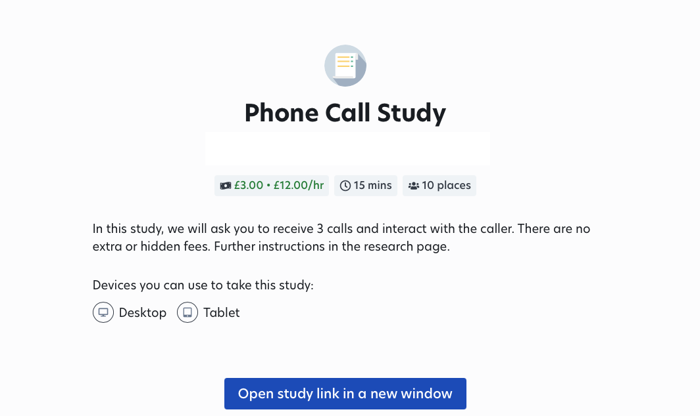

We used Prolific to recruit participants for our study.
The study was advertised only to users that opted-in to participate on deception studies. This enabled us do craft a research journey, that started with a simple recruitment flyer that purposefully didn't have a lot of detail:

After participants opened the study, they were presented with some basic information questions (such as age, occupation and level of studies), and then they were guided to our [terms and conditions](conditions.md) and finally our carefully built [instructions](instructions.md), which followed the process detailed in our paper. Further detail about those sections can be found in the respective sections of our git.

